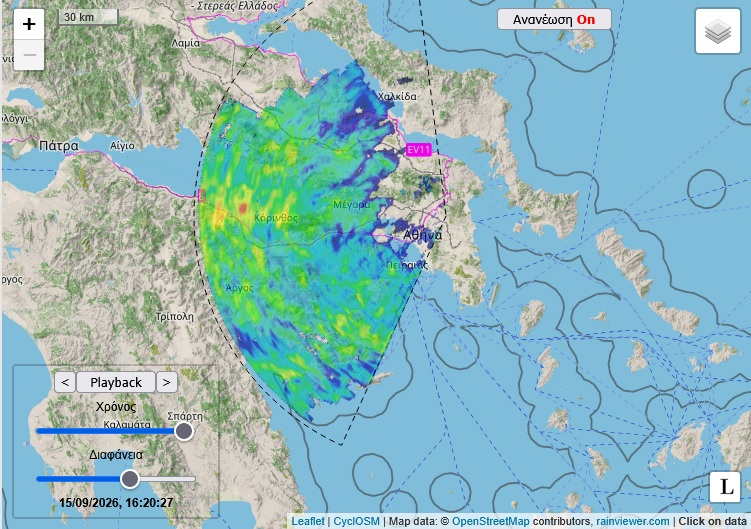

Βροχές και καταιγίδες σημειώνονται σε πολλά μέρη της χώρας αυτή τη στιγμή, δηλαδή στην Πελοπόννησο, τη Στερεά Ελλάδα, τη Θεσσαλία, την Κρήτη αλλά και τις Κυκλάδες. Συννεφιά έχει σημειωθεί από το πρωί σε κάθε μέρος της χώρας, με ελάχιστα μικρά ανοίγματα, ενώ τοπικά τα φαινόμενα είναι ισχυρά. Οι βροχοπτώσεις είναι πολύ πιο γενικευμένες από ό,τι έδειχναν τα προγνωστικά μοντέλα, ένα σενάριο το οποίο είχε συζητηθεί στη χθεσινή πρόγνωση.

Όπως φαίνεται και στην εικόνα της ανάρτησης, σύμφωνα με το ραντάρ του Εθνικού Αστεροσκοπείου Αθηνών, ασθενείς και μέτριας έντασης βροχοπτώσεις σημειώνονται στην Ανατολική Πελοπόννησο και στη Δυτική Αττική εδώ και αρκετές ώρες, ενώ τοπικά στη ΒΑ Πελοπόννησο και την Κεντρική Στερεά οι βροχοπτώσεις είναι ισχυρές, με ραγδαιότητες έως 20-30 mm/h. Πολύ ασθενείς έως ασθενείς βροχοπτώσεις σιγά σιγά κινούνται Β/ΒΑ και αναμένεται να επηρεάσουν την Αττική από τις 17:00 περίπου. Ενώ δεν θα έχουν καμία ένταση, ενδέχεται να έχουν αξιοπρεπή διάρκεια, με τα φαινόμενα να επιμένουν για κάποιες ώρες.

Από εδώ και πέρα, όσο το χαμηλό στο Ιόνιο θα κινείται ανατολικά, τα φαινόμενα θα ενταθούν τοπικά στην Πελοπόννησο και την Κρήτη, με ισχυρές βροχές και καταιγίδες να εκδηλώνονται και τις βραδινές ώρες, ενώ η πιθανότητα για ισχυρές ριπές ανέμου είναι υπαρκτή. Από το βράδυ τα φαινόμενα θα αρχίσουν να εξασθενούν σε Θεσσαλία και Στερεά Ελλάδα.